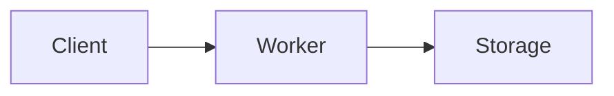
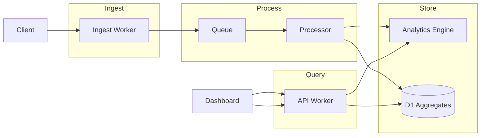

# Cloudflare Architecture Design Wizard

Design production-ready Cloudflare architectures with proper service selection, configuration generation, and visual documentation.

**Arguments:** "$ARGUMENTS"

## Quick Start

```bash
/cf-design                          # Interactive mode
/cf-design api gateway with auth    # Describe your use case
/cf-design --template=pipeline      # Start from template
/cf-design migrate express to workers  # Migration assistance
```

## Templates

### `--template=api` - API Gateway
REST/GraphQL API with D1 database, KV caching, and optional auth.
- Hono router
- D1 for persistence
- KV for hot cache
- Smart Placement enabled

### `--template=pipeline` - Event Pipeline
Ingest → Queue → Process → Store pattern with DLQ.
- High-throughput ingestion
- Queue-based processing
- R2 for raw data
- Analytics Engine for metrics

### `--template=ai` - AI Application
LLM-powered app with RAG and conversation history.
- Workers AI integration
- AI Gateway for caching/logging
- Vectorize for embeddings
- KV for prompt deduplication

### `--template=static` - Static Site + Functions
Marketing/docs site with API endpoints.
- R2 for static assets
- Worker for API routes
- D1 for dynamic data

## Design Workflow

### Step 1: Requirements Discovery

For the use case provided, gather:

1. **Traffic Profile**
   - Expected requests/second (peak and average)
   - Geographic distribution of users
   - Read vs write ratio

2. **Data Requirements**
   - Data types and sizes
   - Relationships (relational vs key-value)
   - Retention requirements

3. **Processing Needs**
   - Sync vs async operations
   - Latency requirements
   - Long-running tasks

4. **Budget**
   - Target monthly cost
   - Cost sensitivity per component

### Step 2: Architecture Design

Based on requirements:

1. **Select Services**
   - Storage: D1, KV, R2, Vectorize, Analytics Engine
   - Compute: Workers, Queues, Workflows, Durable Objects
   - AI: Workers AI, AI Gateway

2. **Design Data Flow**
   - Request path
   - Storage interactions
   - Async processing

3. **Security Boundaries**
   - Authentication points
   - Rate limiting needs
   - CORS configuration

### Step 3: Generate Outputs

Produce:

1. **Mermaid Architecture Diagram**


2. **Wrangler Configuration**
```jsonc
{
  "name": "project-name",
  "main": "src/index.ts",
  // ... complete config
}
```

3. **Cost Estimate**
| Service | Usage | Monthly Cost |
|---------|-------|--------------|
| Workers | X req/mo | $X.XX |
| D1 | X reads/writes | $X.XX |
| **Total** | | **$X.XX** |

4. **Implementation Roadmap**
- Phase 1: Core Worker + D1
- Phase 2: Add caching layer
- Phase 3: Add queue processing

## Example Output

```markdown
# Architecture Design: Event Analytics Platform

## Requirements Summary
- 1M events/day ingestion
- 7-day retention
- Real-time dashboards
- Geographic: Global

## Architecture



## Service Selection

| Component | Service | Justification |
|-----------|---------|---------------|
| Ingestion | Worker | Low latency edge processing |
| Buffering | Queue | Decouple ingest from processing |
| Raw events | Analytics Engine | Free, handles sampling |
| Aggregates | D1 | Queryable for dashboards |

## Wrangler Configuration

```jsonc
{
  "name": "event-analytics",
  "main": "src/index.ts",
  "compatibility_date": "2025-01-01",
  "placement": { "mode": "smart" },
  "observability": { "logs": { "enabled": true } },
  "d1_databases": [
    { "binding": "DB", "database_name": "analytics", "database_id": "..." }
  ],
  "analytics_engine_datasets": [
    { "binding": "EVENTS", "dataset": "raw_events" }
  ],
  "queues": {
    "producers": [
      { "binding": "EVENT_QUEUE", "queue": "events" }
    ],
    "consumers": [
      {
        "queue": "events",
        "max_batch_size": 100,
        "max_retries": 1,
        "dead_letter_queue": "events-dlq",
        "max_concurrency": 10
      }
    ]
  }
}
```

## Cost Estimate

| Service | Calculation | Monthly |
|---------|-------------|---------|
| Workers | 30M req × $0.30/M | $9.00 |
| Queues | 30M msg × $0.40/M | $12.00 |
| D1 Writes | 1M × $1.00/M | $1.00 |
| D1 Reads | 10M × $0.25/B | $0.00 |
| Analytics Engine | Free | $0.00 |
| **Total** | | **$22.00** |

## Implementation Roadmap

### Phase 1: Core (Week 1)
- [ ] Set up Worker with Hono
- [ ] Create D1 schema
- [ ] Implement ingest endpoint

### Phase 2: Processing (Week 2)
- [ ] Add Queue for async processing
- [ ] Implement processor consumer
- [ ] Add DLQ handling

### Phase 3: Analytics (Week 3)
- [ ] Integrate Analytics Engine
- [ ] Build dashboard API
- [ ] Add aggregation logic
```

## Tips

- Start with a template for common patterns
- Always include DLQ for production queues
- Use Analytics Engine for metrics (it's free)
- Enable Smart Placement for global latency
- Plan indexes before implementing D1 queries

## MCP Tools Used

- `mcp__cloudflare-docs__search_cloudflare_documentation` - Best practices
- `mcp__cloudflare-bindings__workers_list` - Existing workers
- `mcp__cloudflare-bindings__d1_databases_list` - Existing D1 databases
- `mcp__cloudflare-bindings__kv_namespaces_list` - Existing KV namespaces
- `mcp__cloudflare-bindings__r2_buckets_list` - Existing R2 buckets
