# Cloudflare Architect Skill

Design production-ready Cloudflare architectures with proper service selection, wrangler configuration generation, visual diagrams, **and Edge-Native Constraint enforcement**.

## Core Capabilities

### 1. Architecture Design
- Service selection based on use case requirements
- Data flow design between components
- Scalability and cost trade-off analysis
- Security boundary definition

### 2. Configuration Generation
- Complete wrangler.toml/wrangler.jsonc files
- Environment-specific configurations (dev/staging/prod)
- Binding declarations with proper naming
- Trigger configuration (routes, crons, queues)

### 3. Visual Documentation
- Mermaid architecture diagrams
- Data flow sequence diagrams
- Component relationship graphs

### 4. Edge-Native Constraint Validation
- Cross-reference proposed code against Workers runtime compatibility
- Flag non-standard Node.js libraries
- Suggest `node:` polyfills or Cloudflare alternatives
- Verify compatibility flags in wrangler config

### 5. Workers + Assets Architecture (NEW v1.4.0)
- Default to unified Worker with `[assets]` block for frontend + API
- Flag deprecated `[site]` configurations
- Recommend migration from legacy Pages to Workers + Assets model

### 6. Wrangler Health Check

Before designing or deploying, verify the local wrangler installation is current.

**Check Command**:
```bash
npx wrangler --version
```

**Version Advisory Table** (as of 2026-01):

| Installed Version | Status | Recommendation |
|-------------------|--------|----------------|
| 3.100+ | Current | Good to go |
| 3.80-3.99 | Acceptable | Update when convenient |
| 3.50-3.79 | Outdated | Update recommended: `npm install -g wrangler@latest` |
| <3.50 | Critical | Update required - missing important features |

**Key Version Features**:
- 3.100+: Enhanced D1 Time Travel, improved `wrangler dev`
- 3.80+: Vectorize GA support, better error messages
- 3.60+: Queues improvements, better observability
- 3.50+: nodejs_compat_v2 flag support

**Wrangler Health Check Output**:
```markdown
## Wrangler Health Check

**Installed**: wrangler 3.95.0
**Status**: ✅ Acceptable (current is 3.102.0)
**Recommendation**: Update when convenient for latest features

To update: `npm install -g wrangler@latest`
```

**When to Run**:
- Before `/cf-design` architecture sessions
- Before first deployment to new environment
- When encountering unexpected wrangler errors

## Service Selection Matrix

### Storage Selection

| Need | Service | Limits | Cost |
|------|---------|--------|------|
| Relational queries | D1 | 10GB, 128MB memory | $0.25/B reads, $1/M writes |
| Key-value lookups | KV | 25MB/value, 1 write/sec/key | $0.50/M reads, $5/M writes |
| Large files/blobs | R2 | 5TB/object | $0.36/M reads, $4.50/M writes |
| Coordination/locks | Durable Objects | Per-object isolation | CPU time based |
| Time-series metrics | Analytics Engine | Adaptive sampling | FREE |
| Vector similarity | Vectorize | 1536 dims, 5M vectors | $0.01/M queries |

### Compute Selection

| Need | Service | Limits | Best For |
|------|---------|--------|----------|
| HTTP handlers | Workers (Isolates) | 128MB, 30s/req | API endpoints |
| Background jobs | Queues | 128KB/msg, batches ≤100 | Async processing |
| Long-running tasks | Workflows | 1024 steps, 1GB state | Multi-step pipelines |
| Stateful coordination | Durable Objects | Per-object | Sessions, locks |
| Scheduled jobs | Cron Triggers | 1-minute minimum | Periodic tasks |
| OS-level dependencies | **Containers (Beta)** | Full Linux | FFmpeg, headless browsers |

## Workload Router: Isolates vs Containers (NEW v1.4.0)

**IMPORTANT**: Cloudflare Containers launched in Beta (2025). The strict "Edge-Native" constraints no longer apply to ALL workloads. Use this decision tree to select the right compute model.

### Decision Tree

```
Does your workload require OS-level dependencies?
│
├─ NO: Does it need Node.js fs, net, or child_process?
│   │
│   ├─ NO: Use Workers (Isolates)
│   │       ✅ Standard API/Web workloads
│   │       ✅ Database CRUD (D1, KV, R2)
│   │       ✅ AI inference (Workers AI)
│   │       ✅ WebSocket handling (Durable Objects)
│   │
│   └─ YES: Can it be replaced with Cloudflare services?
│       │
│       ├─ fs → R2 (object storage)
│       │    Use Workers (Isolates)
│       │
│       ├─ net/http → fetch() or Hyperdrive
│       │    Use Workers (Isolates)
│       │
│       └─ child_process → Containers (if truly needed)
│            Use Containers (Beta)
│
└─ YES: What OS-level dependency?
    │
    ├─ FFmpeg (video processing)
    │    Use Containers
    │    OR: Cloudflare Stream for simple transcoding
    │
    ├─ Puppeteer/Playwright (headless browser)
    │    Use Containers
    │    OR: Cloudflare Browser Rendering API
    │
    ├─ ImageMagick/Sharp (image processing)
    │    Use Containers
    │    OR: Cloudflare Images for transforms
    │
    ├─ Python with native libs (numpy, pandas, scipy)
    │    Use Containers
    │    Note: Python scripts in Workers have limitations
    │
    └─ Long-running processes (>30 seconds)
         Use Containers or Workflows
         Containers: Arbitrary duration, full control
         Workflows: Step-based, automatic retry/resume
```

### Comparison: Workers (Isolates) vs Containers

| Aspect | Workers (Isolates) | Containers (Beta) |
|--------|-------------------|-------------------|
| **Startup** | ~0ms (instant) | ~seconds (cold start) |
| **Memory** | 128MB | Configurable (256MB-4GB) |
| **CPU Time** | 30s max | Configurable (minutes-hours) |
| **Runtime** | V8 isolate (JS/WASM) | Full Linux container |
| **File System** | ❌ No (use R2) | ✅ Yes (ephemeral) |
| **Native Binaries** | ❌ No | ✅ Yes |
| **Network** | fetch() only | Full TCP/UDP |
| **Cost** | $0.30/M requests | Per-second billing |
| **Scale** | Instant, global | Regional, warm pools |
| **Best For** | APIs, web, serverless | Heavy compute, native deps |

### Container Configuration (When Needed)

```jsonc
{
  "name": "video-processor",
  "main": "src/index.ts",
  "compatibility_date": "2025-01-01",

  // Container configuration (Beta)
  "containers": {
    "enabled": true,
    "image": "my-registry/video-processor:latest",
    "memory": "1GB",
    "cpu": 1,
    "command": ["python", "process.py"],
    "env": {
      "FFMPEG_PATH": "/usr/bin/ffmpeg"
    }
  },

  // Queue triggers container processing
  "queues": {
    "consumers": [{
      "queue": "video-jobs",
      "max_batch_size": 1,
      "max_retries": 2,
      "dead_letter_queue": "video-jobs-dlq"
    }]
  }
}
```

### Hybrid Architecture: Workers + Containers

For complex applications, combine both:

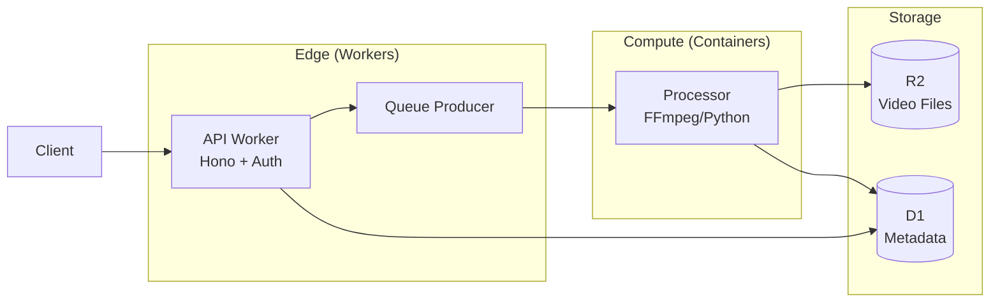

**Implementation Pattern:**

```typescript
// Worker: Handle API requests, queue heavy jobs
app.post('/api/videos/process', async (c) => {
  // Validate and store input
  const videoKey = await storeUpload(c.env.R2, c.req);

  // Queue for container processing (not in Worker)
  await c.env.VIDEO_QUEUE.send({
    type: 'process_video',
    videoKey,
    options: { format: 'mp4', quality: 'high' }
  });

  return c.json({ status: 'queued', videoKey });
});

// Container (separate process): Heavy lifting
// container/process.py
import ffmpeg

def process_video(video_key, options):
    # Download from R2
    input_path = download_from_r2(video_key)

    # FFmpeg processing (not possible in Workers)
    ffmpeg.input(input_path).output(
        output_path,
        format=options['format'],
        vcodec='libx264'
    ).run()

    # Upload result to R2
    upload_to_r2(output_path)
```

### When to Avoid Containers

**Use Workers Instead When:**
- Simple API endpoints (no native deps)
- Database operations (D1, KV, R2)
- AI inference (Workers AI handles this)
- Image transformations (Cloudflare Images)
- Video delivery (Cloudflare Stream)
- PDF generation (use WebAssembly libs)

**Container Overhead:**
- Cold start latency (seconds vs milliseconds)
- Higher cost for simple operations
- Regional deployment vs global edge
- Container registry management

### Cloudflare Alternatives to Native Dependencies

| Native Dependency | Cloudflare Alternative |
|-------------------|------------------------|
| FFmpeg | Cloudflare Stream (transcode, HLS) |
| Puppeteer | Browser Rendering API |
| Sharp/ImageMagick | Cloudflare Images |
| Redis | KV, Durable Objects |
| PostgreSQL/MySQL | Hyperdrive (connection pooling) |
| S3 SDK | R2 (S3-compatible API) |

### AI/ML Selection

| Need | Service | Cost | Best For |
|------|---------|------|----------|
| LLM inference | Workers AI | $0.011/1K neurons | Serverless AI |
| LLM caching/logging | AI Gateway | Free tier + $0.10/M | Production AI |
| Embeddings + search | Vectorize | Per-dimension | RAG, semantic search |

## Edge-Native Constraints

**IMPORTANT**: Cloudflare Workers use a V8 isolate runtime, NOT Node.js. Always validate proposed code against these constraints.

### Node.js API Compatibility

Workers supports many Node.js APIs via `node:` prefixed imports when `nodejs_compat` or `nodejs_compat_v2` flag is enabled.

| Node.js Module | Workers Support | Required Flag | Notes |
|----------------|-----------------|---------------|-------|
| `node:assert` | Partial | `nodejs_compat` | Basic assertions |
| `node:async_hooks` | Yes | `nodejs_compat` | AsyncLocalStorage supported |
| `node:buffer` | Yes | `nodejs_compat` | Full Buffer API |
| `node:crypto` | Yes | `nodejs_compat` | Prefer Web Crypto when possible |
| `node:events` | Yes | `nodejs_compat` | EventEmitter |
| `node:path` | Yes | `nodejs_compat` | Path manipulation |
| `node:stream` | Partial | `nodejs_compat` | Web Streams preferred |
| `node:url` | Yes | `nodejs_compat` | URL parsing |
| `node:util` | Partial | `nodejs_compat` | Common utilities |
| `node:zlib` | Yes | `nodejs_compat` | Compression |
| `node:fs` | NO | - | **Use R2 instead** |
| `node:net` | NO | - | **Use TCP sockets (beta)** |
| `node:child_process` | NO | - | **Not available** |
| `node:cluster` | NO | - | **Edge inherently distributed** |
| `node:http` | NO | - | **Use fetch()** |
| `node:https` | NO | - | **Use fetch()** |

### Common Library Compatibility

| Library | Works? | Alternative | Notes |
|---------|--------|-------------|-------|
| `express` | NO | **Hono, itty-router** | Hono is recommended |
| `axios` | Partial | **fetch()** | Native fetch preferred |
| `lodash` | Yes | - | Works, but increases bundle |
| `moment` | Yes | **dayjs, date-fns** | Moment is heavy |
| `uuid` | Yes | **crypto.randomUUID()** | Native is better |
| `bcrypt` | NO | **bcryptjs** | Pure JS version works |
| `sharp` | NO | **Cloudflare Images** | Use Images API |
| `puppeteer` | NO | **Browser Rendering API** | Cloudflare has native |
| `pg` | NO | **Hyperdrive** | Use Hyperdrive for Postgres |
| `mysql2` | NO | **Hyperdrive** | Use Hyperdrive for MySQL |
| `mongodb` | Partial | - | Use fetch to Atlas API |
| `redis` | NO | **KV, Durable Objects** | Use native services |
| `aws-sdk` | Partial | **R2 S3 API** | R2 is S3-compatible |
| `@prisma/client` | Yes | - | D1 adapter available |
| `drizzle-orm` | Yes | - | Recommended for D1 |

### Compatibility Flag Configuration

When using Node.js APIs, add to wrangler config:

```jsonc
{
  "compatibility_flags": ["nodejs_compat_v2"],  // Recommended: latest Node.js compat
  // OR for legacy:
  // "compatibility_flags": ["nodejs_compat"]
}
```

### Edge-Native Validation Workflow

When reviewing proposed architecture or dependencies:

```
1. Scan package.json for known incompatible libraries
2. Flag any `require('fs')` or `require('net')` patterns
3. Check for `node:` imports without compat flags
4. Suggest Cloudflare-native alternatives:
   - fs → R2
   - net/http → fetch()
   - express → Hono
   - redis → KV/DO
   - postgres → Hyperdrive
   - image processing → Images API
5. Verify wrangler.toml has appropriate compat flags
```

### Runtime Limits to Consider

| Limit | Free | Standard | Unbound |
|-------|------|----------|---------|
| Request timeout | 10ms CPU | 30s wall | 30s wall |
| Memory | 128MB | 128MB | 128MB |
| Bundle size | 1MB | 10MB | 10MB |
| Subrequests | 50 | 1000 | 1000 |
| Environment vars | 64 | 128 | 128 |
| Cron triggers | 3 | 5 | 5 |

### Example: Edge-Native Migration

**Before (Node.js pattern):**
```javascript
const express = require('express');
const fs = require('fs');
const Redis = require('ioredis');

const app = express();
app.get('/file/:id', async (req, res) => {
  const content = fs.readFileSync(`./uploads/${req.params.id}`);
  await redis.set(`cache:${req.params.id}`, content);
  res.send(content);
});
```

**After (Edge-Native):**
```typescript
import { Hono } from 'hono';

const app = new Hono<{ Bindings: Env }>();

app.get('/file/:id', async (c) => {
  const obj = await c.env.R2_BUCKET.get(c.req.param('id'));
  if (!obj) return c.notFound();

  // Cache in KV for fast reads
  await c.env.KV_CACHE.put(`file:${c.req.param('id')}`, await obj.text(), { expirationTtl: 3600 });

  return new Response(obj.body);
});

export default app;
```

## Workers + Assets Architecture (NEW v1.4.0)

**IMPORTANT**: Cloudflare has architecturally merged Pages into Workers. The legacy `pages_build_output_dir` and `[site]` configurations are being replaced by the `[assets]` block within `wrangler.toml`. This allows a single Worker to serve both frontend (SPA) and backend API.

### Legacy vs Modern Configuration

**DEPRECATED - Legacy `[site]` config:**
```toml
# ❌ DEPRECATED - Don't use [site] for new projects
[site]
bucket = "./dist"
```

**DEPRECATED - Legacy Pages config:**
```toml
# ❌ DEPRECATED - pages_build_output_dir is being phased out
pages_build_output_dir = "./dist"
```

**RECOMMENDED - Modern `[assets]` config:**
```jsonc
{
  "name": "my-fullstack-app",
  "main": "src/worker.ts",
  "compatibility_date": "2025-01-01",

  // NEW: Unified assets block
  "assets": {
    "directory": "./dist",     // Static files directory (Vite/Next.js output)
    "binding": "ASSETS",       // Optional: Access assets in Worker code
    "html_handling": "auto-trailing-slash",  // SPA routing
    "not_found_handling": "single-page-application"  // 404 → index.html for SPAs
  },

  // API bindings alongside assets
  "d1_databases": [
    { "binding": "DB", "database_name": "app-db", "database_id": "..." }
  ]
}
```

### Migration from Legacy Configurations

If you encounter a project with `[site]` or `pages_build_output_dir`:

```
Legacy Configuration Migration:
- Detected: [site] block in wrangler.toml
- Status: ⚠️ DEPRECATED - Will stop working in future wrangler versions
- Action Required: Migrate to [assets] block

Migration Steps:
1. Replace [site] with assets block:
   BEFORE:
   [site]
   bucket = "./dist"

   AFTER:
   "assets": {
     "directory": "./dist",
     "html_handling": "auto-trailing-slash",
     "not_found_handling": "single-page-application"
   }

2. Update build scripts if needed:
   - Ensure frontend build outputs to the directory specified
   - Vite: vite.config.ts → build.outDir: "./dist"
   - Next.js: next.config.js → output: "export", distDir: "./dist"

3. Test locally: npx wrangler dev
```

### Unified Worker + Assets Pattern

**Use Case**: Fullstack application with React/Vue/Svelte frontend and API backend.

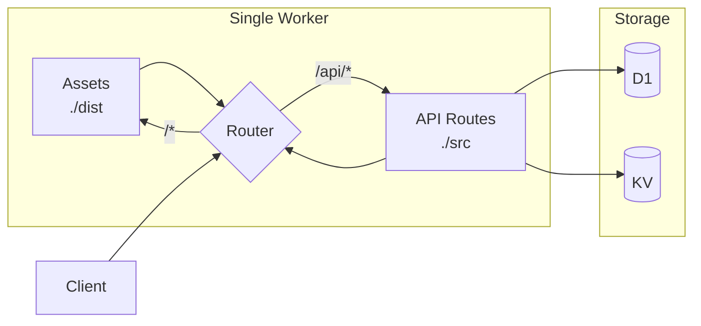

**Implementation:**

```typescript
// src/worker.ts
import { Hono } from 'hono';
import { apiRoutes } from './routes/api';

const app = new Hono<{ Bindings: Env }>();

// API routes handled by Worker
app.route('/api', apiRoutes);

// Static assets handled by assets binding (automatic)
// Requests not matching /api/* are served from ./dist

export default app;
```

**Wrangler Configuration:**

```jsonc
{
  "name": "fullstack-app",
  "main": "src/worker.ts",
  "compatibility_date": "2025-01-01",
  "assets": {
    "directory": "./dist",
    "binding": "ASSETS",
    "html_handling": "auto-trailing-slash",
    "not_found_handling": "single-page-application"
  },
  "d1_databases": [
    { "binding": "DB", "database_name": "app-db", "database_id": "..." }
  ],
  "kv_namespaces": [
    { "binding": "CACHE", "id": "..." }
  ]
}
```

### When to Use Workers + Assets

| Scenario | Recommendation |
|----------|----------------|
| New fullstack app | ✅ Use Workers + Assets |
| Existing Pages project | ⚠️ Migrate to Workers + Assets |
| Static-only site | ✅ Workers + Assets (simpler than Pages) |
| API-only backend | Use Worker without assets block |
| Complex multi-site | Consider separate Workers with service bindings |

## Architecture Templates

### Template 1: API Gateway

**Use Case**: REST/GraphQL API with database backend

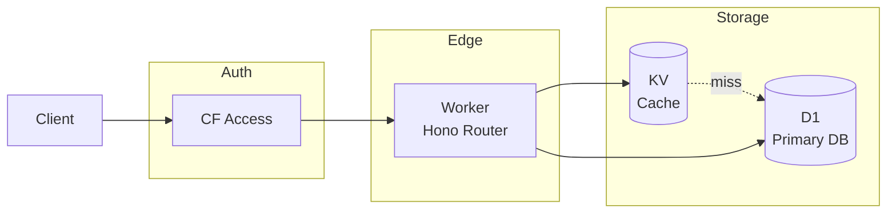

**Wrangler Config**:
```jsonc
{
  "name": "api-gateway",
  "main": "src/index.ts",
  "compatibility_date": "2025-01-01",
  "placement": { "mode": "smart" },
  "observability": { "logs": { "enabled": true } },
  "d1_databases": [
    { "binding": "DB", "database_name": "api-db", "database_id": "..." }
  ],
  "kv_namespaces": [
    { "binding": "CACHE", "id": "..." }
  ],
  "routes": [
    { "pattern": "api.example.com/*", "zone_name": "example.com" }
  ]
}
```

### Template 2: Event Pipeline

**Use Case**: Ingest events, process async, store results

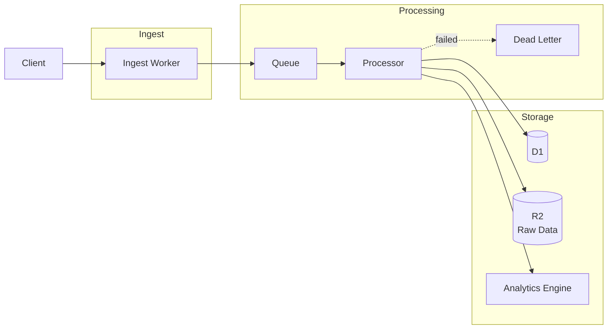

**Wrangler Config**:
```jsonc
{
  "name": "event-pipeline",
  "main": "src/index.ts",
  "compatibility_date": "2025-01-01",
  "observability": { "logs": { "enabled": true } },
  "d1_databases": [
    { "binding": "DB", "database_name": "events-db", "database_id": "..." }
  ],
  "r2_buckets": [
    { "binding": "RAW_DATA", "bucket_name": "events-raw" }
  ],
  "analytics_engine_datasets": [
    { "binding": "METRICS", "dataset": "event_metrics" }
  ],
  "queues": {
    "producers": [
      { "binding": "EVENTS_QUEUE", "queue": "events" }
    ],
    "consumers": [
      {
        "queue": "events",
        "max_batch_size": 100,
        "max_retries": 1,
        "dead_letter_queue": "events-dlq",
        "max_concurrency": 10
      }
    ]
  }
}
```

### Template 3: AI Application

**Use Case**: LLM-powered application with RAG

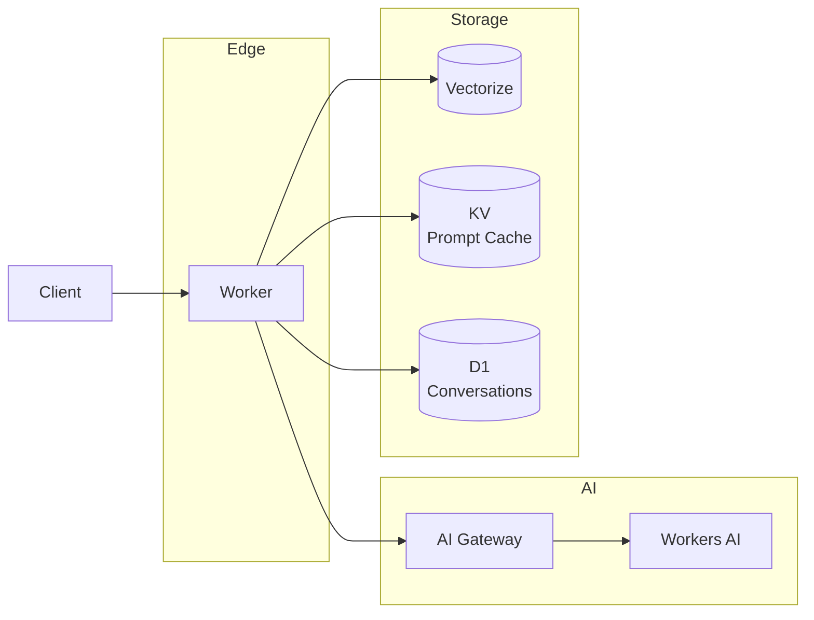

**Wrangler Config**:
```jsonc
{
  "name": "ai-app",
  "main": "src/index.ts",
  "compatibility_date": "2025-01-01",
  "placement": { "mode": "smart" },
  "observability": { "logs": { "enabled": true } },
  "ai": { "binding": "AI" },
  "vectorize": [
    { "binding": "VECTORS", "index_name": "knowledge-base" }
  ],
  "kv_namespaces": [
    { "binding": "PROMPT_CACHE", "id": "..." }
  ],
  "d1_databases": [
    { "binding": "DB", "database_name": "conversations", "database_id": "..." }
  ],
  "vars": {
    "AI_GATEWAY_SLUG": "ai-app-gateway"
  }
}
```

### Template 4: Fullstack App (Workers + Assets)

**Use Case**: Fullstack SPA with API backend (React, Vue, Svelte, etc.)

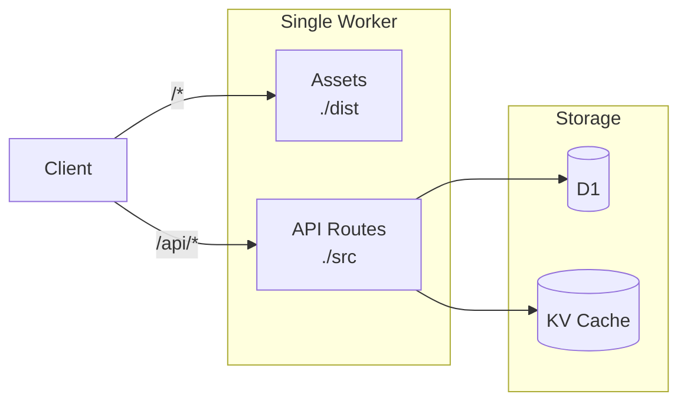

**Wrangler Config** (Modern `[assets]` block):
```jsonc
{
  "name": "fullstack-app",
  "main": "src/worker.ts",
  "compatibility_date": "2025-01-01",

  // NEW: Unified assets serving (replaces [site] and Pages)
  "assets": {
    "directory": "./dist",              // Vite/Next.js/SvelteKit output
    "binding": "ASSETS",                // Optional: access in Worker code
    "html_handling": "auto-trailing-slash",
    "not_found_handling": "single-page-application"  // 404 → index.html for SPA routing
  },

  "d1_databases": [
    { "binding": "DB", "database_name": "app-db", "database_id": "..." }
  ],
  "kv_namespaces": [
    { "binding": "CACHE", "id": "..." }
  ],
  "routes": [
    { "pattern": "example.com/*", "zone_name": "example.com" }
  ]
}
```

**Worker Implementation:**
```typescript
// src/worker.ts
import { Hono } from 'hono';
import { apiRoutes } from './routes/api';

const app = new Hono<{ Bindings: Env }>();

// API routes
app.route('/api', apiRoutes);

// Health check
app.get('/health', (c) => c.json({ status: 'ok' }));

// All other routes serve static assets automatically
// (handled by assets binding)

export default app;
```

> **Note**: This replaces the legacy `[site]` and `pages_build_output_dir` configurations. See "Workers + Assets Architecture" section above for migration guide.

## Design Workflow

### Step 1: Requirements Gathering

Ask about:
1. **Traffic patterns**: Requests/second, geographic distribution
2. **Data characteristics**: Size, structure, access patterns
3. **Processing needs**: Sync vs async, latency requirements
4. **Budget constraints**: Target monthly cost
5. **Compliance**: Data residency, encryption requirements

### Step 2: Service Selection

For each requirement, select appropriate service:
- High read:write ratio → KV for reads, D1 for writes
- Large files → R2 with presigned URLs
- Time-series data → Analytics Engine (free)
- Search/similarity → Vectorize
- Long processes → Workflows or Queues
- Real-time coordination → Durable Objects

### Step 3: Architecture Draft

Create initial Mermaid diagram showing:
- All Workers and their responsibilities
- Storage bindings and data flow
- Queue topology (if async processing)
- External service integrations

### Step 4: Configuration Generation

Generate wrangler.jsonc with:
- All bindings properly named
- Environment-specific overrides
- Proper placement mode
- Observability enabled
- Queue DLQs configured

### Step 5: Cost Estimation

Calculate monthly costs using:
- Request volume × $0.30/M (Workers)
- Storage GB × service rates
- Operation counts × service rates
- AI usage × neuron/token rates

### Step 6: Review Checklist

Before finalizing, verify:
- [ ] All queues have DLQs
- [ ] D1 has appropriate indexes planned
- [ ] Smart placement enabled for latency-sensitive
- [ ] Observability configured
- [ ] Secrets use wrangler secret (not vars)
- [ ] Rate limiting for public APIs

## Mermaid Diagram Patterns

### Basic Worker Flow
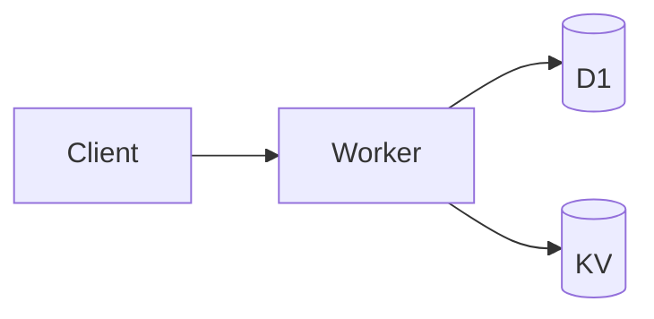

### Queue Processing
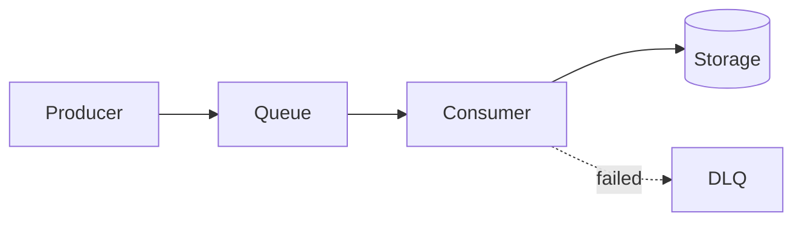

### Service Bindings
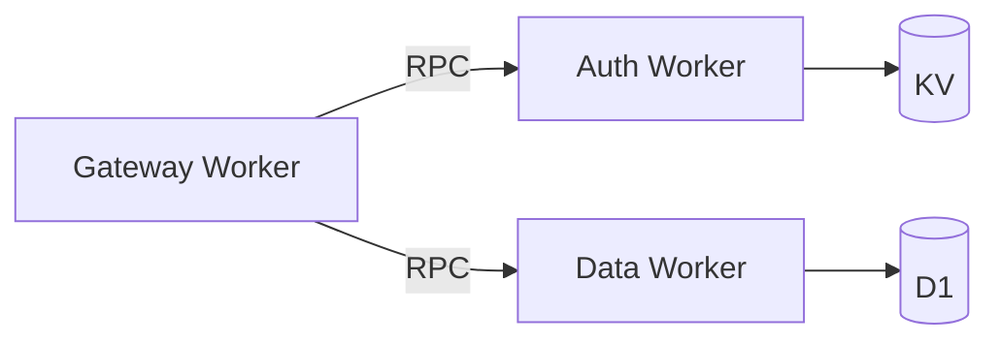

### Multi-Region
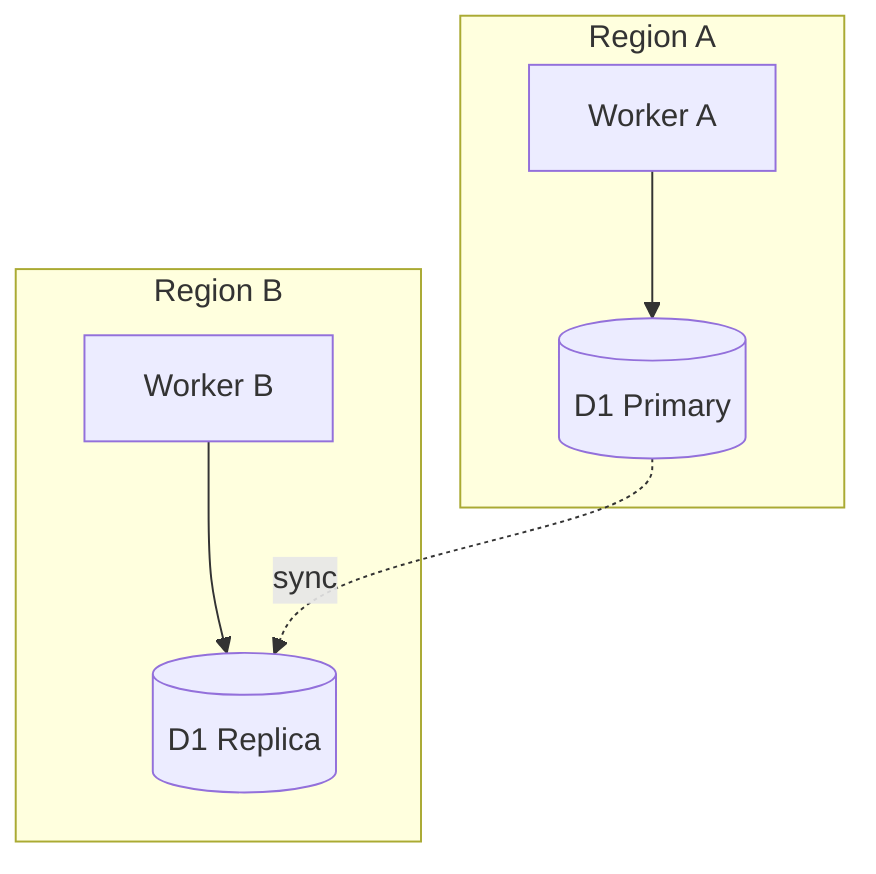

## Output Format

When designing an architecture, provide:

1. **Requirements Summary** - Confirmed requirements
2. **Architecture Diagram** - Mermaid visualization
3. **Service Justification** - Why each service was chosen
4. **Wrangler Configuration** - Complete, deployable config
5. **Cost Estimate** - Monthly projection with breakdown
6. **Migration Path** - If replacing existing system
7. **Next Steps** - Implementation order

## Billing Safety Limits (Loop Protection)

**CRITICAL**: Infinite loops, accidental recursion, and runaway processes are direct billing multipliers in serverless. A tight loop can burn through D1 rows, R2 operations, and DO duration charges in seconds.

### CPU Time Caps

By default, paid Workers have a 30s CPU limit—enormous for a buggy loop. **Always enforce lower limits** for standard API workers:

```jsonc
{
  // wrangler.jsonc - Billing Safety Limits
  "limits": {
    "cpu_ms": 100  // Kill execution if CPU churns >100ms (prevents tight loops)
  }
}
```

**Recommended CPU Limits by Use Case**:

| Use Case | cpu_ms | Rationale |
|----------|--------|-----------|
| Simple API endpoint | 50-100 | Fast response, no loops |
| Database CRUD | 100-200 | D1 queries + serialization |
| AI inference | 500-1000 | Model loading + inference |
| Heavy processing | 5000 | Large data transforms |
| Background queue | 10000 | Batch processing |

### Subrequest Limits & Fan-Out Protection

Workers have internal subrequest limits (50 free, 1000 paid), but architecture should avoid "fan-out" patterns where one Worker calls many others:

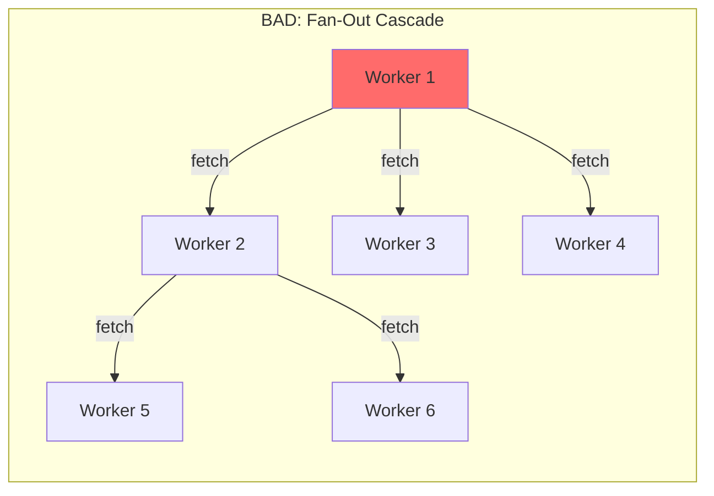

**Solution**: Use Service Bindings (RPC, not HTTP) or Queue-based orchestration:

```jsonc
{
  // GOOD: Service Bindings (no HTTP overhead, no subrequest count)
  "services": [
    { "binding": "AUTH_SERVICE", "service": "auth-worker" },
    { "binding": "DATA_SERVICE", "service": "data-worker" }
  ]
}
```

### Self-Recursion Protection

**Always** reference the `loop-breaker` skill when designing Workers that may call themselves or other Workers via fetch(). See @skills/loop-breaker/SKILL.md for middleware patterns.

### Architecture Checklist - Billing Safety

When designing new architectures, verify:

- [ ] `limits.cpu_ms` set appropriately for use case
- [ ] No Worker-to-Worker `fetch()` chains (use Service Bindings)
- [ ] Queue consumers have `max_retries` ≤ 2
- [ ] Durable Objects don't use `setInterval` without clear termination
- [ ] D1 queries are not inside unbounded loops
- [ ] R2 writes are buffered, not per-item

## Anti-Patterns to Avoid

| Anti-Pattern | Problem | Solution |
|--------------|---------|----------|
| HTTP between Workers | 1000 subrequest limit | Service Bindings RPC |
| D1 as queue | Expensive, no guarantees | Use Queues |
| KV for large files | 25MB limit, expensive | Use R2 |
| Polling for events | Wasteful, slow | Queues or WebSocket |
| Per-request AI calls | Expensive, slow | Cache with KV |
| No DLQ | Lost messages | Always add DLQ |
| Missing cpu_ms limit | Runaway loops bill forever | Set `limits.cpu_ms` |
| Worker self-recursion | Infinite billing chain | Use recursion depth headers |
| setInterval in DO | Keeps DO billing | Use hibernation API |
| SQL in loops | N+1 = N×cost | Batch queries |
