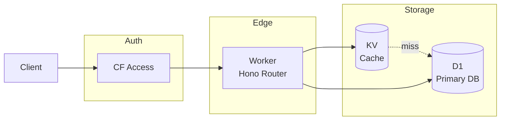
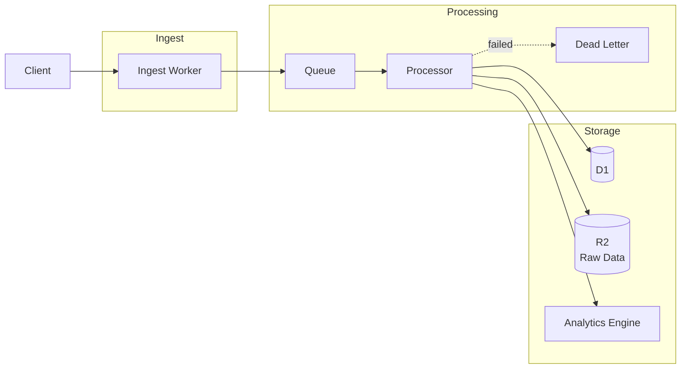
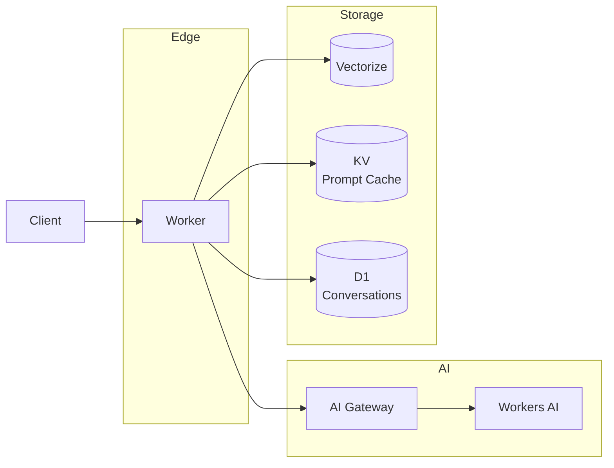
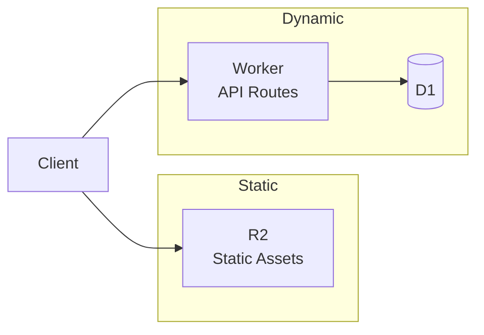
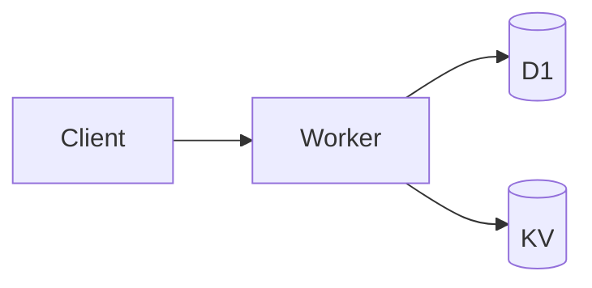
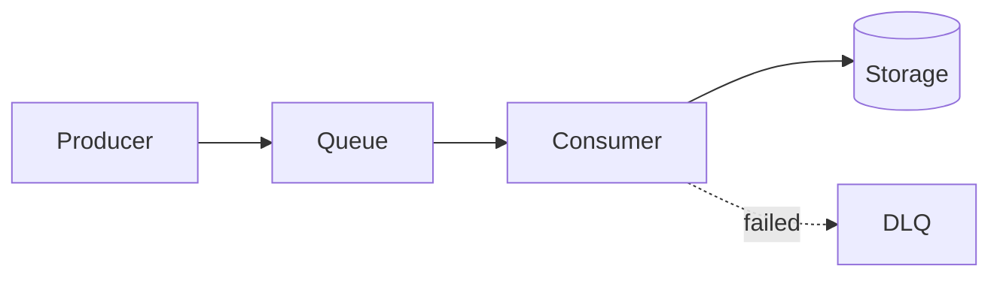
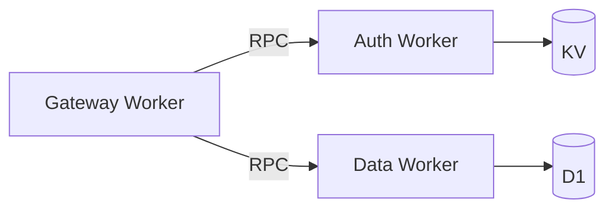
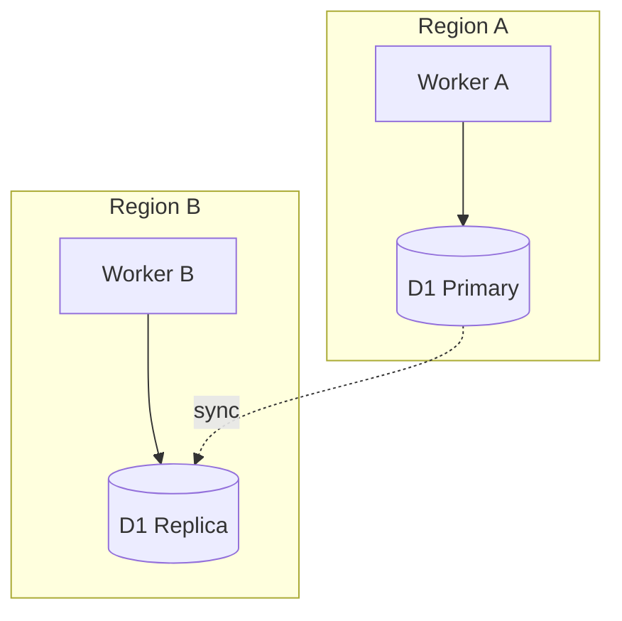

# Cloudflare Architect Skill

Design production-ready Cloudflare architectures with proper service selection, wrangler configuration generation, visual diagrams, **and Edge-Native Constraint enforcement**.

## Core Capabilities

### 1. Architecture Design
- Service selection based on use case requirements
- Data flow design between components
- Scalability and cost trade-off analysis
- Security boundary definition

### 2. Configuration Generation
- Complete wrangler.toml/wrangler.jsonc files
- Environment-specific configurations (dev/staging/prod)
- Binding declarations with proper naming
- Trigger configuration (routes, crons, queues)

### 3. Visual Documentation
- Mermaid architecture diagrams
- Data flow sequence diagrams
- Component relationship graphs

### 4. Edge-Native Constraint Validation (NEW)
- Cross-reference proposed code against Workers runtime compatibility
- Flag non-standard Node.js libraries
- Suggest `node:` polyfills or Cloudflare alternatives
- Verify compatibility flags in wrangler config

## Service Selection Matrix

### Storage Selection

| Need | Service | Limits | Cost |
|------|---------|--------|------|
| Relational queries | D1 | 10GB, 128MB memory | $0.25/B reads, $1/M writes |
| Key-value lookups | KV | 25MB/value, 1 write/sec/key | $0.50/M reads, $5/M writes |
| Large files/blobs | R2 | 5TB/object | $0.36/M reads, $4.50/M writes |
| Coordination/locks | Durable Objects | Per-object isolation | CPU time based |
| Time-series metrics | Analytics Engine | Adaptive sampling | FREE |
| Vector similarity | Vectorize | 1536 dims, 5M vectors | $0.01/M queries |

### Compute Selection

| Need | Service | Limits | Best For |
|------|---------|--------|----------|
| HTTP handlers | Workers | 128MB, 30s/req | API endpoints |
| Background jobs | Queues | 128KB/msg, batches ≤100 | Async processing |
| Long-running tasks | Workflows | 1024 steps, 1GB state | Multi-step pipelines |
| Stateful coordination | Durable Objects | Per-object | Sessions, locks |
| Scheduled jobs | Cron Triggers | 1-minute minimum | Periodic tasks |

### AI/ML Selection

| Need | Service | Cost | Best For |
|------|---------|------|----------|
| LLM inference | Workers AI | $0.011/1K neurons | Serverless AI |
| LLM caching/logging | AI Gateway | Free tier + $0.10/M | Production AI |
| Embeddings + search | Vectorize | Per-dimension | RAG, semantic search |

## Edge-Native Constraints

**IMPORTANT**: Cloudflare Workers use a V8 isolate runtime, NOT Node.js. Always validate proposed code against these constraints.

### Node.js API Compatibility

Workers supports many Node.js APIs via `node:` prefixed imports when `nodejs_compat` or `nodejs_compat_v2` flag is enabled.

| Node.js Module | Workers Support | Required Flag | Notes |
|----------------|-----------------|---------------|-------|
| `node:assert` | Partial | `nodejs_compat` | Basic assertions |
| `node:async_hooks` | Yes | `nodejs_compat` | AsyncLocalStorage supported |
| `node:buffer` | Yes | `nodejs_compat` | Full Buffer API |
| `node:crypto` | Yes | `nodejs_compat` | Prefer Web Crypto when possible |
| `node:events` | Yes | `nodejs_compat` | EventEmitter |
| `node:path` | Yes | `nodejs_compat` | Path manipulation |
| `node:stream` | Partial | `nodejs_compat` | Web Streams preferred |
| `node:url` | Yes | `nodejs_compat` | URL parsing |
| `node:util` | Partial | `nodejs_compat` | Common utilities |
| `node:zlib` | Yes | `nodejs_compat` | Compression |
| `node:fs` | NO | - | **Use R2 instead** |
| `node:net` | NO | - | **Use TCP sockets (beta)** |
| `node:child_process` | NO | - | **Not available** |
| `node:cluster` | NO | - | **Edge inherently distributed** |
| `node:http` | NO | - | **Use fetch()** |
| `node:https` | NO | - | **Use fetch()** |

### Common Library Compatibility

| Library | Works? | Alternative | Notes |
|---------|--------|-------------|-------|
| `express` | NO | **Hono, itty-router** | Hono is recommended |
| `axios` | Partial | **fetch()** | Native fetch preferred |
| `lodash` | Yes | - | Works, but increases bundle |
| `moment` | Yes | **dayjs, date-fns** | Moment is heavy |
| `uuid` | Yes | **crypto.randomUUID()** | Native is better |
| `bcrypt` | NO | **bcryptjs** | Pure JS version works |
| `sharp` | NO | **Cloudflare Images** | Use Images API |
| `puppeteer` | NO | **Browser Rendering API** | Cloudflare has native |
| `pg` | NO | **Hyperdrive** | Use Hyperdrive for Postgres |
| `mysql2` | NO | **Hyperdrive** | Use Hyperdrive for MySQL |
| `mongodb` | Partial | - | Use fetch to Atlas API |
| `redis` | NO | **KV, Durable Objects** | Use native services |
| `aws-sdk` | Partial | **R2 S3 API** | R2 is S3-compatible |
| `@prisma/client` | Yes | - | D1 adapter available |
| `drizzle-orm` | Yes | - | Recommended for D1 |

### Compatibility Flag Configuration

When using Node.js APIs, add to wrangler config:

```jsonc
{
  "compatibility_flags": ["nodejs_compat_v2"],  // Recommended: latest Node.js compat
  // OR for legacy:
  // "compatibility_flags": ["nodejs_compat"]
}
```

### Edge-Native Validation Workflow

When reviewing proposed architecture or dependencies:

```
1. Scan package.json for known incompatible libraries
2. Flag any `require('fs')` or `require('net')` patterns
3. Check for `node:` imports without compat flags
4. Suggest Cloudflare-native alternatives:
   - fs → R2
   - net/http → fetch()
   - express → Hono
   - redis → KV/DO
   - postgres → Hyperdrive
   - image processing → Images API
5. Verify wrangler.toml has appropriate compat flags
```

### Runtime Limits to Consider

| Limit | Free | Standard | Unbound |
|-------|------|----------|---------|
| Request timeout | 10ms CPU | 30s wall | 30s wall |
| Memory | 128MB | 128MB | 128MB |
| Bundle size | 1MB | 10MB | 10MB |
| Subrequests | 50 | 1000 | 1000 |
| Environment vars | 64 | 128 | 128 |
| Cron triggers | 3 | 5 | 5 |

### Example: Edge-Native Migration

**Before (Node.js pattern):**
```javascript
const express = require('express');
const fs = require('fs');
const Redis = require('ioredis');

const app = express();
app.get('/file/:id', async (req, res) => {
  const content = fs.readFileSync(`./uploads/${req.params.id}`);
  await redis.set(`cache:${req.params.id}`, content);
  res.send(content);
});
```

**After (Edge-Native):**
```typescript
import { Hono } from 'hono';

const app = new Hono<{ Bindings: Env }>();

app.get('/file/:id', async (c) => {
  const obj = await c.env.R2_BUCKET.get(c.req.param('id'));
  if (!obj) return c.notFound();

  // Cache in KV for fast reads
  await c.env.KV_CACHE.put(`file:${c.req.param('id')}`, await obj.text(), { expirationTtl: 3600 });

  return new Response(obj.body);
});

export default app;
```

## Architecture Templates

### Template 1: API Gateway

**Use Case**: REST/GraphQL API with database backend



**Wrangler Config**:
```jsonc
{
  "name": "api-gateway",
  "main": "src/index.ts",
  "compatibility_date": "2025-01-01",
  "placement": { "mode": "smart" },
  "observability": { "logs": { "enabled": true } },
  "d1_databases": [
    { "binding": "DB", "database_name": "api-db", "database_id": "..." }
  ],
  "kv_namespaces": [
    { "binding": "CACHE", "id": "..." }
  ],
  "routes": [
    { "pattern": "api.example.com/*", "zone_name": "example.com" }
  ]
}
```

### Template 2: Event Pipeline

**Use Case**: Ingest events, process async, store results



**Wrangler Config**:
```jsonc
{
  "name": "event-pipeline",
  "main": "src/index.ts",
  "compatibility_date": "2025-01-01",
  "observability": { "logs": { "enabled": true } },
  "d1_databases": [
    { "binding": "DB", "database_name": "events-db", "database_id": "..." }
  ],
  "r2_buckets": [
    { "binding": "RAW_DATA", "bucket_name": "events-raw" }
  ],
  "analytics_engine_datasets": [
    { "binding": "METRICS", "dataset": "event_metrics" }
  ],
  "queues": {
    "producers": [
      { "binding": "EVENTS_QUEUE", "queue": "events" }
    ],
    "consumers": [
      {
        "queue": "events",
        "max_batch_size": 100,
        "max_retries": 1,
        "dead_letter_queue": "events-dlq",
        "max_concurrency": 10
      }
    ]
  }
}
```

### Template 3: AI Application

**Use Case**: LLM-powered application with RAG



**Wrangler Config**:
```jsonc
{
  "name": "ai-app",
  "main": "src/index.ts",
  "compatibility_date": "2025-01-01",
  "placement": { "mode": "smart" },
  "observability": { "logs": { "enabled": true } },
  "ai": { "binding": "AI" },
  "vectorize": [
    { "binding": "VECTORS", "index_name": "knowledge-base" }
  ],
  "kv_namespaces": [
    { "binding": "PROMPT_CACHE", "id": "..." }
  ],
  "d1_databases": [
    { "binding": "DB", "database_name": "conversations", "database_id": "..." }
  ],
  "vars": {
    "AI_GATEWAY_SLUG": "ai-app-gateway"
  }
}
```

### Template 4: Static Site with Functions

**Use Case**: Marketing site with API endpoints



**Wrangler Config**:
```jsonc
{
  "name": "marketing-site",
  "main": "src/worker.ts",
  "compatibility_date": "2025-01-01",
  "assets": {
    "directory": "./dist",
    "binding": "ASSETS"
  },
  "d1_databases": [
    { "binding": "DB", "database_name": "site-db", "database_id": "..." }
  ],
  "routes": [
    { "pattern": "example.com/*", "zone_name": "example.com" }
  ]
}
```

## Design Workflow

### Step 1: Requirements Gathering

Ask about:
1. **Traffic patterns**: Requests/second, geographic distribution
2. **Data characteristics**: Size, structure, access patterns
3. **Processing needs**: Sync vs async, latency requirements
4. **Budget constraints**: Target monthly cost
5. **Compliance**: Data residency, encryption requirements

### Step 2: Service Selection

For each requirement, select appropriate service:
- High read:write ratio → KV for reads, D1 for writes
- Large files → R2 with presigned URLs
- Time-series data → Analytics Engine (free)
- Search/similarity → Vectorize
- Long processes → Workflows or Queues
- Real-time coordination → Durable Objects

### Step 3: Architecture Draft

Create initial Mermaid diagram showing:
- All Workers and their responsibilities
- Storage bindings and data flow
- Queue topology (if async processing)
- External service integrations

### Step 4: Configuration Generation

Generate wrangler.jsonc with:
- All bindings properly named
- Environment-specific overrides
- Proper placement mode
- Observability enabled
- Queue DLQs configured

### Step 5: Cost Estimation

Calculate monthly costs using:
- Request volume × $0.30/M (Workers)
- Storage GB × service rates
- Operation counts × service rates
- AI usage × neuron/token rates

### Step 6: Review Checklist

Before finalizing, verify:
- [ ] All queues have DLQs
- [ ] D1 has appropriate indexes planned
- [ ] Smart placement enabled for latency-sensitive
- [ ] Observability configured
- [ ] Secrets use wrangler secret (not vars)
- [ ] Rate limiting for public APIs

## Mermaid Diagram Patterns

### Basic Worker Flow


### Queue Processing


### Service Bindings


### Multi-Region


## Output Format

When designing an architecture, provide:

1. **Requirements Summary** - Confirmed requirements
2. **Architecture Diagram** - Mermaid visualization
3. **Service Justification** - Why each service was chosen
4. **Wrangler Configuration** - Complete, deployable config
5. **Cost Estimate** - Monthly projection with breakdown
6. **Migration Path** - If replacing existing system
7. **Next Steps** - Implementation order

## Anti-Patterns to Avoid

| Anti-Pattern | Problem | Solution |
|--------------|---------|----------|
| HTTP between Workers | 1000 subrequest limit | Service Bindings RPC |
| D1 as queue | Expensive, no guarantees | Use Queues |
| KV for large files | 25MB limit, expensive | Use R2 |
| Polling for events | Wasteful, slow | Queues or WebSocket |
| Per-request AI calls | Expensive, slow | Cache with KV |
| No DLQ | Lost messages | Always add DLQ |
