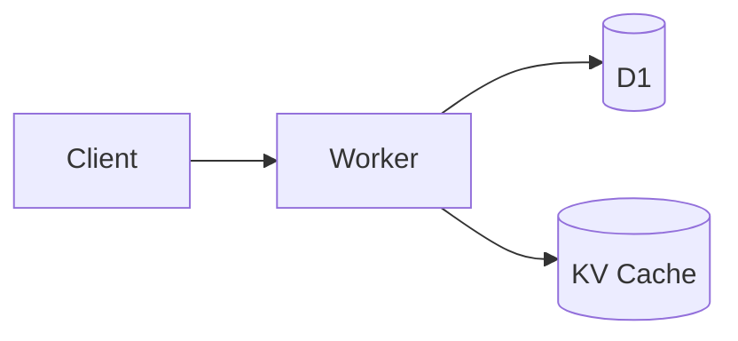
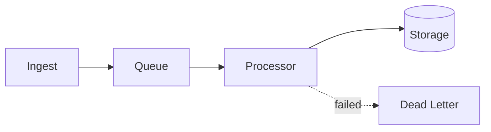
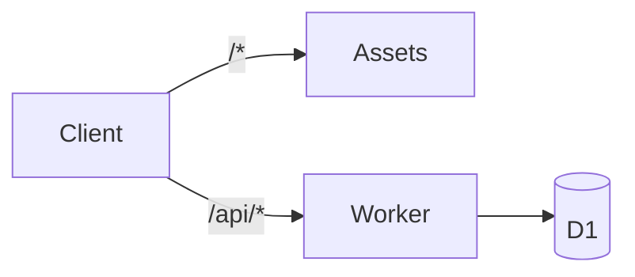

# Cloudflare Architect Skill

Design production-ready Cloudflare architectures with proper service selection, wrangler configuration generation, visual diagrams, and Edge-Native Constraint enforcement.

## Core Capabilities

1. **Architecture Design** - Service selection, data flow, scalability/cost trade-offs
2. **Configuration Generation** - Complete wrangler.toml/jsonc with all bindings
3. **Visual Documentation** - Mermaid diagrams for architecture and data flow
4. **Edge-Native Validation** - Cross-reference code against Workers runtime compatibility
5. **Workers + Assets** - Unified Worker with `[assets]` block for frontend + API

## Service Selection Matrix

### Storage Selection

| Need | Service | Limits | Cost |
|------|---------|--------|------|
| Relational queries | D1 | 10GB, 128MB memory | $0.25/B reads, $1/M writes |
| Key-value lookups | KV | 25MB/value, 1 write/sec/key | $0.50/M reads, $5/M writes |
| Large files/blobs | R2 | 5TB/object | $0.36/M reads, $4.50/M writes |
| Coordination/locks | Durable Objects | Per-object isolation | CPU time based |
| Time-series metrics | Analytics Engine | Adaptive sampling | FREE |
| Vector similarity | Vectorize | 1536 dims, 5M vectors | $0.01/M queries |

### Compute Selection

| Need | Service | Limits | Best For |
|------|---------|--------|----------|
| HTTP handlers | Workers (Isolates) | 128MB, 30s/req | API endpoints |
| Background jobs | Queues | 128KB/msg, batches ≤100 | Async processing |
| Long-running tasks | Workflows | 1024 steps, 1GB state | Multi-step pipelines |
| Stateful coordination | Durable Objects | Per-object | Sessions, locks |
| Scheduled jobs | Cron Triggers | 1-minute minimum | Periodic tasks |
| OS-level dependencies | Containers (Beta) | Full Linux | FFmpeg, headless browsers |

### AI/ML Selection

| Need | Service | Cost | Best For |
|------|---------|------|----------|
| LLM inference | Workers AI | $0.011/1K neurons | Serverless AI |
| LLM caching/logging | AI Gateway | Free tier + $0.10/M | Production AI |
| Embeddings + search | Vectorize | Per-dimension | RAG, semantic search |

## Workload Router

Select the right compute model:

- **Workers (Isolates)**: Standard APIs, database CRUD, AI inference via Workers AI
- **Python Workers**: Pure Python scripts, AI SDKs (limited packages)
- **Containers (Beta)**: FFmpeg, Puppeteer, numpy/pandas, long-running processes

**See**: `references/workload-router.md` for decision trees and compatibility tables.

## Edge-Native Constraints

Workers use V8 isolates, NOT Node.js. Key incompatibilities:

| Can't Use | Alternative |
|-----------|-------------|
| `express` | Hono, itty-router |
| `fs` | R2 |
| `pg`, `mysql2` | Hyperdrive |
| `sharp` | Cloudflare Images |
| `puppeteer` | Browser Rendering API |
| `redis` | KV, Durable Objects |

**See**: `references/edge-constraints.md` for full compatibility tables.

## Workers + Assets (Replaces Pages)

For fullstack apps, use unified Worker with `[assets]` block:

```jsonc
{
  "name": "fullstack-app",
  "main": "src/worker.ts",
  "assets": {
    "directory": "./dist",
    "not_found_handling": "single-page-application"
  }
}
```

**See**: `references/workers-assets.md` for migration from legacy `[site]` and Pages.

## Wrangler Health Check

Before designing, verify wrangler version:

```bash
npx wrangler --version
```

| Version | Status | Action |
|---------|--------|--------|
| 3.100+ | Current | Good to go |
| 3.80-3.99 | Acceptable | Update when convenient |
| <3.80 | Outdated | `npm install -g wrangler@latest` |

## Design Workflow

### Step 1: Requirements Gathering

Ask about:
1. **Traffic patterns**: Requests/second, geographic distribution
2. **Data characteristics**: Size, structure, access patterns
3. **Processing needs**: Sync vs async, latency requirements
4. **Budget constraints**: Target monthly cost
5. **Compliance**: Data residency, encryption requirements

### Step 2: Service Selection

For each requirement, select appropriate service using the matrices above.

### Step 3: Architecture Draft

Create Mermaid diagram showing:
- All Workers and their responsibilities
- Storage bindings and data flow
- Queue topology (if async processing)
- External service integrations

**See**: `references/architecture-templates.md` for pre-built templates.

### Step 4: Configuration Generation

Generate wrangler.jsonc with:
- All bindings properly named
- Environment-specific overrides
- Proper placement mode
- Observability enabled
- Queue DLQs configured

### Step 5: Cost Estimation

Calculate monthly costs using service rates from the selection matrices.

### Step 6: Review Checklist

Before finalizing:
- [ ] All queues have DLQs
- [ ] D1 has appropriate indexes planned
- [ ] Smart placement enabled for latency-sensitive
- [ ] Observability configured
- [ ] Secrets use wrangler secret (not vars)
- [ ] Rate limiting for public APIs
- [ ] `limits.cpu_ms` set appropriately

## Billing Safety Limits

**CRITICAL**: Set CPU limits to prevent runaway loops:

```jsonc
{
  "limits": {
    "cpu_ms": 100  // Kill execution if CPU churns >100ms
  }
}
```

| Use Case | cpu_ms |
|----------|--------|
| Simple API | 50-100 |
| Database CRUD | 100-200 |
| AI inference | 500-1000 |
| Heavy processing | 5000 |

**See**: `references/billing-safety.md` for anti-patterns and protection strategies.

## Output Format

When designing an architecture, provide:

1. **Requirements Summary** - Confirmed requirements
2. **Architecture Diagram** - Mermaid visualization
3. **Service Justification** - Why each service was chosen
4. **Wrangler Configuration** - Complete, deployable config
5. **Cost Estimate** - Monthly projection with breakdown
6. **Migration Path** - If replacing existing system
7. **Next Steps** - Implementation order

## Quick Reference Diagrams

### Basic API


### Event Pipeline


### Fullstack App


## Related Skills

- **implement**: Scaffold code with Hono, Drizzle patterns
- **loop-breaker**: Recursion guards for Worker-to-Worker calls
- **guardian**: Security and budget auditing
- **patterns**: Detailed architecture patterns (service-bindings, circuit-breaker, d1-batching)

## Reference Files

- `references/edge-constraints.md` - Node.js API and library compatibility
- `references/workload-router.md` - Isolates vs Containers vs Python decision trees
- `references/workers-assets.md` - Pages migration and unified Worker patterns
- `references/architecture-templates.md` - Pre-built architecture configs
- `references/billing-safety.md` - Loop protection and anti-patterns
