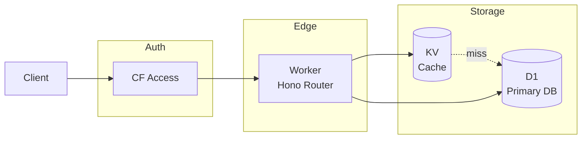
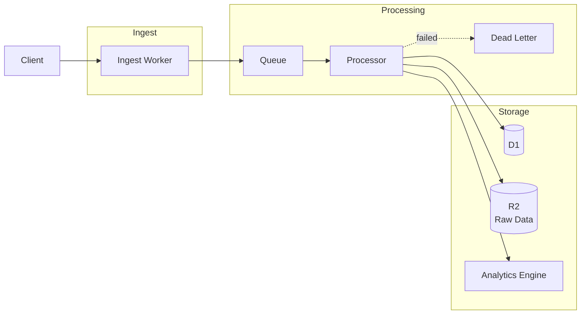
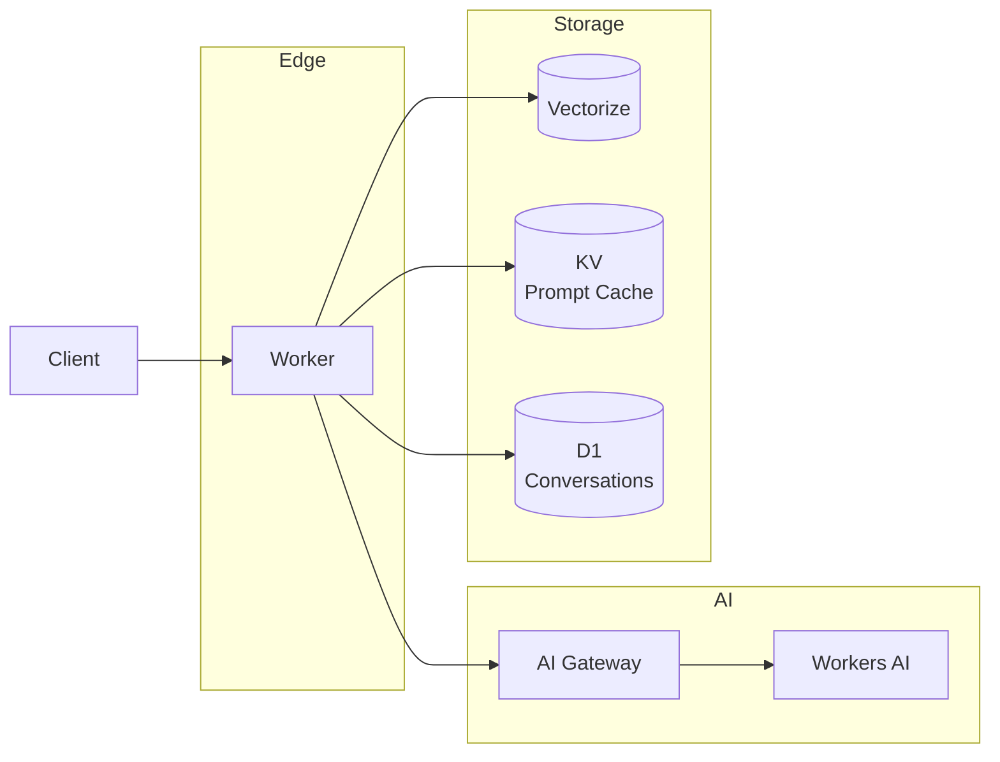
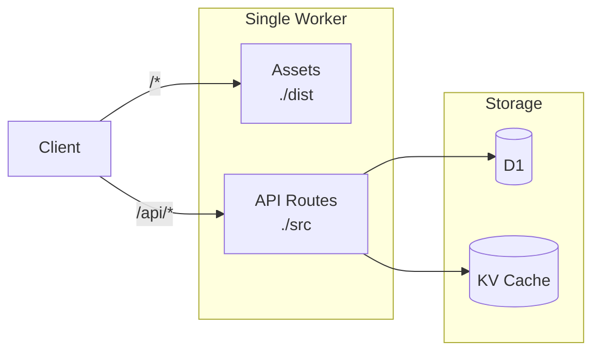
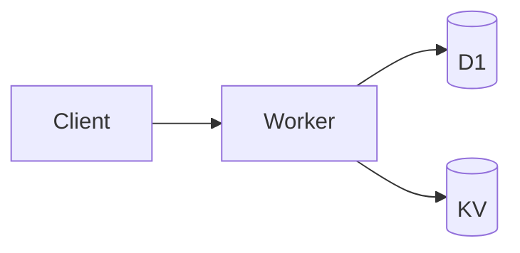
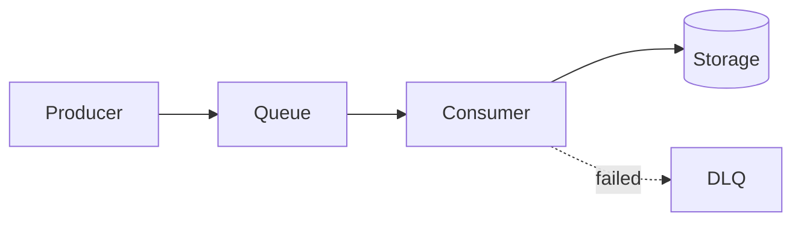
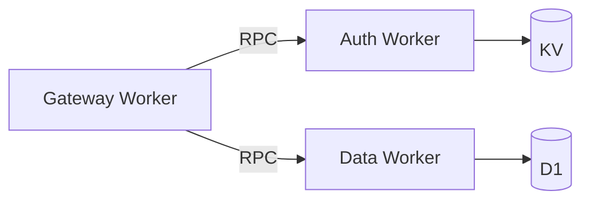
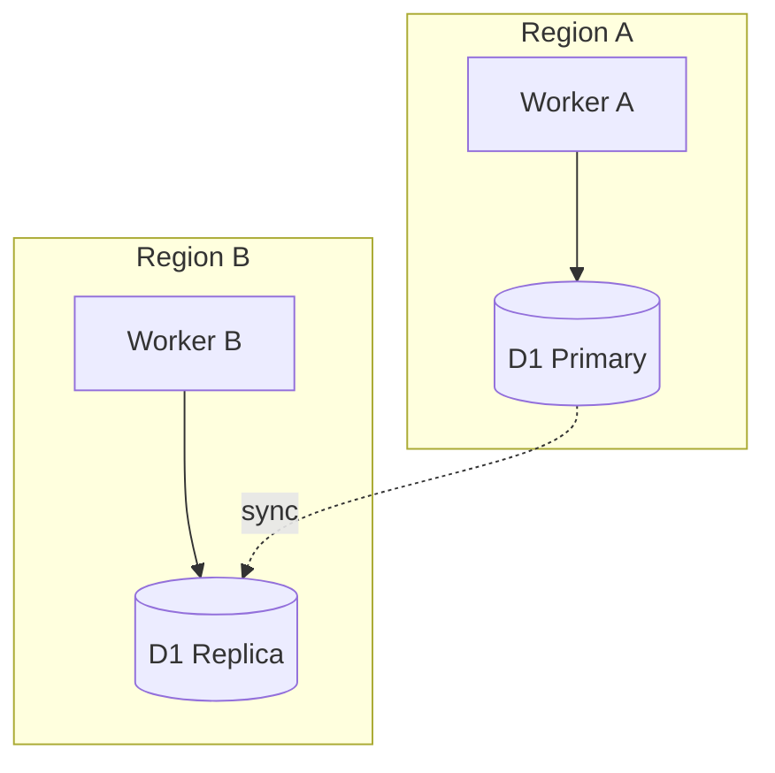

# Architecture Templates

Pre-built architecture patterns for common Cloudflare use cases.

## Template 1: API Gateway

**Use Case**: REST/GraphQL API with database backend



**Wrangler Config**:
```jsonc
{
  "name": "api-gateway",
  "main": "src/index.ts",
  "compatibility_date": "2025-01-01",
  "placement": { "mode": "smart" },
  "observability": { "logs": { "enabled": true } },
  "d1_databases": [
    { "binding": "DB", "database_name": "api-db", "database_id": "..." }
  ],
  "kv_namespaces": [
    { "binding": "CACHE", "id": "..." }
  ],
  "routes": [
    { "pattern": "api.example.com/*", "zone_name": "example.com" }
  ]
}
```

---

## Template 2: Event Pipeline

**Use Case**: Ingest events, process async, store results



**Wrangler Config**:
```jsonc
{
  "name": "event-pipeline",
  "main": "src/index.ts",
  "compatibility_date": "2025-01-01",
  "observability": { "logs": { "enabled": true } },
  "d1_databases": [
    { "binding": "DB", "database_name": "events-db", "database_id": "..." }
  ],
  "r2_buckets": [
    { "binding": "RAW_DATA", "bucket_name": "events-raw" }
  ],
  "analytics_engine_datasets": [
    { "binding": "METRICS", "dataset": "event_metrics" }
  ],
  "queues": {
    "producers": [
      { "binding": "EVENTS_QUEUE", "queue": "events" }
    ],
    "consumers": [
      {
        "queue": "events",
        "max_batch_size": 100,
        "max_retries": 1,
        "dead_letter_queue": "events-dlq",
        "max_concurrency": 10
      }
    ]
  }
}
```

---

## Template 3: AI Application

**Use Case**: LLM-powered application with RAG



**Wrangler Config**:
```jsonc
{
  "name": "ai-app",
  "main": "src/index.ts",
  "compatibility_date": "2025-01-01",
  "placement": { "mode": "smart" },
  "observability": { "logs": { "enabled": true } },
  "ai": { "binding": "AI" },
  "vectorize": [
    { "binding": "VECTORS", "index_name": "knowledge-base" }
  ],
  "kv_namespaces": [
    { "binding": "PROMPT_CACHE", "id": "..." }
  ],
  "d1_databases": [
    { "binding": "DB", "database_name": "conversations", "database_id": "..." }
  ],
  "vars": {
    "AI_GATEWAY_SLUG": "ai-app-gateway"
  }
}
```

---

## Template 4: Fullstack App (Workers + Assets)

**Use Case**: Fullstack SPA with API backend (React, Vue, Svelte, etc.)



**Wrangler Config** (Modern `[assets]` block):
```jsonc
{
  "name": "fullstack-app",
  "main": "src/worker.ts",
  "compatibility_date": "2025-01-01",

  // NEW: Unified assets serving (replaces [site] and Pages)
  "assets": {
    "directory": "./dist",              // Vite/Next.js/SvelteKit output
    "binding": "ASSETS",                // Optional: access in Worker code
    "html_handling": "auto-trailing-slash",
    "not_found_handling": "single-page-application"  // 404 → index.html for SPA routing
  },

  "d1_databases": [
    { "binding": "DB", "database_name": "app-db", "database_id": "..." }
  ],
  "kv_namespaces": [
    { "binding": "CACHE", "id": "..." }
  ],
  "routes": [
    { "pattern": "example.com/*", "zone_name": "example.com" }
  ]
}
```

**Worker Implementation:**
```typescript
// src/worker.ts
import { Hono } from 'hono';
import { apiRoutes } from './routes/api';

const app = new Hono<{ Bindings: Env }>();

// API routes
app.route('/api', apiRoutes);

// Health check
app.get('/health', (c) => c.json({ status: 'ok' }));

// All other routes serve static assets automatically
// (handled by assets binding)

export default app;
```

> **Note**: This replaces the legacy `[site]` and `pages_build_output_dir` configurations. See `workers-assets.md` for migration guide.

---

## Mermaid Diagram Patterns

### Basic Worker Flow


### Queue Processing


### Service Bindings


### Multi-Region

