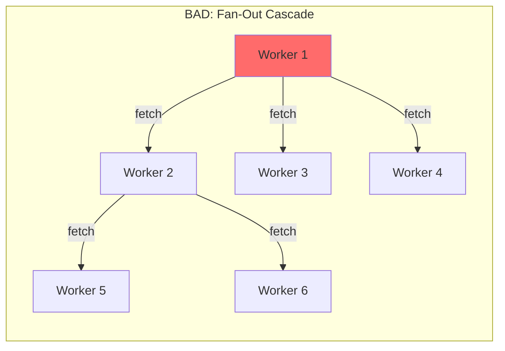

# Billing Safety Limits (Loop Protection)

**CRITICAL**: Infinite loops, accidental recursion, and runaway processes are direct billing multipliers in serverless. A tight loop can burn through D1 rows, R2 operations, and DO duration charges in seconds.

## CPU Time Caps

By default, paid Workers have a 30s CPU limit—enormous for a buggy loop. **Always enforce lower limits** for standard API workers:

```jsonc
{
  // wrangler.jsonc - Billing Safety Limits
  "limits": {
    "cpu_ms": 100  // Kill execution if CPU churns >100ms (prevents tight loops)
  }
}
```

**Recommended CPU Limits by Use Case**:

| Use Case | cpu_ms | Rationale |
|----------|--------|-----------|
| Simple API endpoint | 50-100 | Fast response, no loops |
| Database CRUD | 100-200 | D1 queries + serialization |
| AI inference | 500-1000 | Model loading + inference |
| Heavy processing | 5000 | Large data transforms |
| Background queue | 10000 | Batch processing |

## Subrequest Limits & Fan-Out Protection

Workers have internal subrequest limits (50 free, 1000 paid), but architecture should avoid "fan-out" patterns where one Worker calls many others:



**Solution**: Use Service Bindings (RPC, not HTTP) or Queue-based orchestration:

```jsonc
{
  // GOOD: Service Bindings (no HTTP overhead, no subrequest count)
  "services": [
    { "binding": "AUTH_SERVICE", "service": "auth-worker" },
    { "binding": "DATA_SERVICE", "service": "data-worker" }
  ]
}
```

## Self-Recursion Protection

**Always** reference the `loop-breaker` skill when designing Workers that may call themselves or other Workers via fetch(). See @skills/loop-breaker/SKILL.md for middleware patterns.

## Architecture Checklist - Billing Safety

When designing new architectures, verify:

- [ ] `limits.cpu_ms` set appropriately for use case
- [ ] No Worker-to-Worker `fetch()` chains (use Service Bindings)
- [ ] Queue consumers have `max_retries` ≤ 2
- [ ] Durable Objects don't use `setInterval` without clear termination
- [ ] D1 queries are not inside unbounded loops
- [ ] R2 writes are buffered, not per-item

## Anti-Patterns to Avoid

| Anti-Pattern | Problem | Solution |
|--------------|---------|----------|
| HTTP between Workers | 1000 subrequest limit | Service Bindings RPC |
| D1 as queue | Expensive, no guarantees | Use Queues |
| KV for large files | 25MB limit, expensive | Use R2 |
| Polling for events | Wasteful, slow | Queues or WebSocket |
| Per-request AI calls | Expensive, slow | Cache with KV |
| No DLQ | Lost messages | Always add DLQ |
| Missing cpu_ms limit | Runaway loops bill forever | Set `limits.cpu_ms` |
| Worker self-recursion | Infinite billing chain | Use recursion depth headers |
| setInterval in DO | Keeps DO billing | Use hibernation API |
| SQL in loops | N+1 = N×cost | Batch queries |
