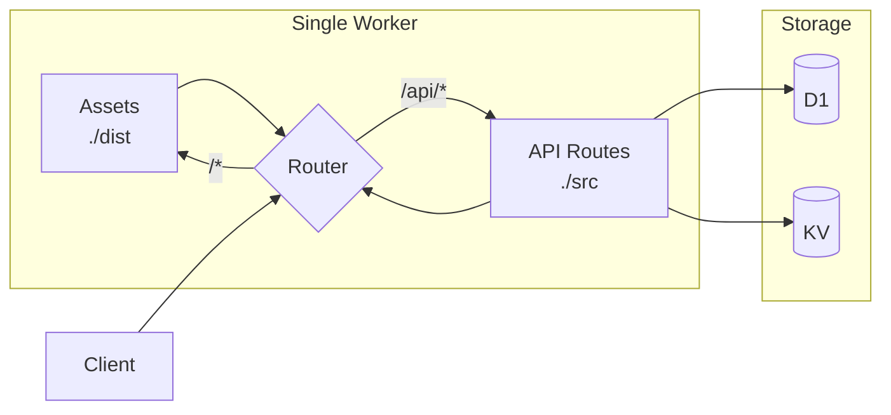

# Workers + Assets Architecture

**IMPORTANT**: Cloudflare has architecturally merged Pages into Workers. The legacy `pages_build_output_dir` and `[site]` configurations are being replaced by the `[assets]` block within `wrangler.toml`. This allows a single Worker to serve both frontend (SPA) and backend API.

## Legacy vs Modern Configuration

**DEPRECATED - Legacy `[site]` config:**
```toml
# ❌ DEPRECATED - Don't use [site] for new projects
[site]
bucket = "./dist"
```

**DEPRECATED - Legacy Pages config:**
```toml
# ❌ DEPRECATED - pages_build_output_dir is being phased out
pages_build_output_dir = "./dist"
```

**RECOMMENDED - Modern `[assets]` config:**
```jsonc
{
  "name": "my-fullstack-app",
  "main": "src/worker.ts",
  "compatibility_date": "2025-01-01",

  // NEW: Unified assets block
  "assets": {
    "directory": "./dist",     // Static files directory (Vite/Next.js output)
    "binding": "ASSETS",       // Optional: Access assets in Worker code
    "html_handling": "auto-trailing-slash",  // SPA routing
    "not_found_handling": "single-page-application"  // 404 → index.html for SPAs
  },

  // API bindings alongside assets
  "d1_databases": [
    { "binding": "DB", "database_name": "app-db", "database_id": "..." }
  ]
}
```

## Migration from Legacy Configurations

If you encounter a project with `[site]` or `pages_build_output_dir`:

```
Legacy Configuration Migration:
- Detected: [site] block in wrangler.toml
- Status: ⚠️ DEPRECATED - Will stop working in future wrangler versions
- Action Required: Migrate to [assets] block

Migration Steps:
1. Replace [site] with assets block:
   BEFORE:
   [site]
   bucket = "./dist"

   AFTER:
   "assets": {
     "directory": "./dist",
     "html_handling": "auto-trailing-slash",
     "not_found_handling": "single-page-application"
   }

2. Update build scripts if needed:
   - Ensure frontend build outputs to the directory specified
   - Vite: vite.config.ts → build.outDir: "./dist"
   - Next.js: next.config.js → output: "export", distDir: "./dist"

3. Test locally: npx wrangler dev
```

## Unified Worker + Assets Pattern

**Use Case**: Fullstack application with React/Vue/Svelte frontend and API backend.



**Implementation:**

```typescript
// src/worker.ts
import { Hono } from 'hono';
import { apiRoutes } from './routes/api';

const app = new Hono<{ Bindings: Env }>();

// API routes handled by Worker
app.route('/api', apiRoutes);

// Static assets handled by assets binding (automatic)
// Requests not matching /api/* are served from ./dist

export default app;
```

**Wrangler Configuration:**

```jsonc
{
  "name": "fullstack-app",
  "main": "src/worker.ts",
  "compatibility_date": "2025-01-01",
  "assets": {
    "directory": "./dist",
    "binding": "ASSETS",
    "html_handling": "auto-trailing-slash",
    "not_found_handling": "single-page-application"
  },
  "d1_databases": [
    { "binding": "DB", "database_name": "app-db", "database_id": "..." }
  ],
  "kv_namespaces": [
    { "binding": "CACHE", "id": "..." }
  ]
}
```

## When to Use Workers + Assets

| Scenario | Recommendation |
|----------|----------------|
| New fullstack app | ✅ Use Workers + Assets |
| Existing Pages project | ⚠️ Migrate to Workers + Assets |
| Static-only site | ✅ Workers + Assets (simpler than Pages) |
| API-only backend | Use Worker without assets block |
| Complex multi-site | Consider separate Workers with service bindings |

## Pages vs Workers Migration Triggers

| Current Situation | Recommendation | Rationale |
|-------------------|----------------|-----------|
| **New project** | Workers + Assets | Modern default, unified deployment |
| **Existing Pages, no issues** | Keep Pages | Migration effort not justified |
| **Pages + separate API Worker** | Migrate to Workers + Assets | Consolidate into single deployment |
| **Pages with Preview Deploys** | Keep Pages (for now) | Preview feature coming to Workers |
| **Pages hitting function limits** | Migrate to Workers + Assets | Workers have higher limits |
| **Need Service Bindings** | Migrate to Workers + Assets | Pages Functions can't use Service Bindings |
| **Need Durable Objects** | Migrate to Workers + Assets | Pages Functions can't use DOs |

## Migration Path

1. Convert `functions/` directory to `src/` with Hono router
2. Replace `_middleware.ts` with Hono middleware
3. Add `assets` block to wrangler.jsonc pointing to build output
4. Update CI/CD from `wrangler pages deploy` to `wrangler deploy`
5. Test Preview Deploys manually until Workers gets native support
