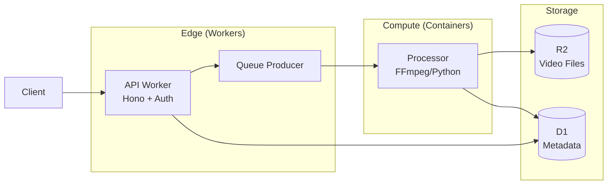

# Workload Router: Isolates vs Containers

**IMPORTANT**: Cloudflare Containers launched in Beta (2025). The strict "Edge-Native" constraints no longer apply to ALL workloads. Use this decision tree to select the right compute model.

## Decision Tree

```
Does your workload require OS-level dependencies?
│
├─ NO: Does it need Node.js fs, net, or child_process?
│   │
│   ├─ NO: Use Workers (Isolates)
│   │       ✅ Standard API/Web workloads
│   │       ✅ Database CRUD (D1, KV, R2)
│   │       ✅ AI inference (Workers AI)
│   │       ✅ WebSocket handling (Durable Objects)
│   │
│   └─ YES: Can it be replaced with Cloudflare services?
│       │
│       ├─ fs → R2 (object storage)
│       │    Use Workers (Isolates)
│       │
│       ├─ net/http → fetch() or Hyperdrive
│       │    Use Workers (Isolates)
│       │
│       └─ child_process → Containers (if truly needed)
│            Use Containers (Beta)
│
└─ YES: What OS-level dependency?
    │
    ├─ FFmpeg (video processing)
    │    Use Containers
    │    OR: Cloudflare Stream for simple transcoding
    │
    ├─ Puppeteer/Playwright (headless browser)
    │    Use Containers
    │    OR: Cloudflare Browser Rendering API
    │
    ├─ ImageMagick/Sharp (image processing)
    │    Use Containers
    │    OR: Cloudflare Images for transforms
    │
    ├─ Python with native libs (numpy, pandas, scipy)
    │    Use Containers
    │    Note: Python scripts in Workers have limitations
    │
    └─ Long-running processes (>30 seconds)
         Use Containers or Workflows
         Containers: Arbitrary duration, full control
         Workflows: Step-based, automatic retry/resume
```

## Comparison: Workers (JS) vs Python Workers vs Containers

| Aspect | Workers (JS/TS) | Python Workers | Containers (Beta) |
|--------|-----------------|----------------|-------------------|
| **Startup** | ~0ms (instant) | ~50-100ms | ~seconds (cold start) |
| **Memory** | 128MB | 128MB | Configurable (256MB-4GB) |
| **CPU Time** | 30s max | 30s max | Configurable (minutes-hours) |
| **Runtime** | V8 isolate | Pyodide (WASM) | Full Linux container |
| **File System** | ❌ No (use R2) | ❌ No (use R2) | ✅ Yes (ephemeral) |
| **Native Binaries** | ❌ No | ❌ Pure Python only | ✅ Yes |
| **Packages** | npm (bundled) | micropip (limited) | pip (full) |
| **Network** | fetch() only | fetch() only | Full TCP/UDP |
| **Cost** | $0.30/M requests | $0.30/M requests | Per-second billing |
| **Scale** | Instant, global | Instant, global | Regional, warm pools |
| **Best For** | APIs, web, serverless | Python scripts, AI | Heavy compute, native deps |

## Python Workers Decision Tree

Python Workers run via Pyodide (Python compiled to WebAssembly). They have access to many pure-Python packages but cannot use native extensions.

```
Is your workload Python-based?
│
├─ NO: Use JavaScript/TypeScript Workers (faster startup)
│
└─ YES: Does it require native Python extensions?
    │
    ├─ NO: Does it need packages from PyPI?
    │   │
    │   ├─ YES: Are they pure Python packages?
    │   │   │
    │   │   ├─ YES: Use Python Workers ✅
    │   │   │       ✅ requests, httpx (use fetch instead)
    │   │   │       ✅ pydantic, dataclasses
    │   │   │       ✅ json, re, datetime, typing
    │   │   │       ✅ langchain (core only)
    │   │   │       ✅ openai, anthropic SDKs
    │   │   │
    │   │   └─ NO: Use Containers
    │   │           ❌ numpy, pandas, scipy
    │   │           ❌ tensorflow, pytorch
    │   │           ❌ opencv-python
    │   │           ❌ psycopg2 (use HTTP APIs)
    │   │
    │   └─ NO: Use Python Workers with stdlib ✅
    │
    └─ YES: Use Containers
            ❌ Any C extension module
            ❌ Cython packages
            ❌ Binary wheels
```

## Incompatible Libraries (Require Containers)

These popular libraries **cannot** run in Workers (JS or Python) due to native dependencies:

| Library | Category | Alternative on Workers |
|---------|----------|----------------------|
| `sharp` | Image processing | Cloudflare Images API |
| `puppeteer` | Headless browser | Browser Rendering API |
| `playwright` | Browser automation | Browser Rendering API |
| `ffmpeg` | Video processing | Cloudflare Stream |
| `numpy` | Numerical computing | Pure Python math / WASM libs |
| `pandas` | Data analysis | Pure Python / process in Container |
| `scipy` | Scientific computing | Containers only |
| `tensorflow` | ML inference | Workers AI (hosted models) |
| `pytorch` | ML inference | Workers AI (hosted models) |
| `opencv-python` | Computer vision | Cloudflare Images + Containers |
| `psycopg2` | PostgreSQL driver | Hyperdrive + HTTP |
| `mysqlclient` | MySQL driver | Hyperdrive + HTTP |
| `bcrypt` | Password hashing | `bcryptjs` (pure JS) |

**Rule of Thumb**: If `pip install` compiles C code or downloads a binary wheel, it won't work in Python Workers.

## Container Configuration (When Needed)

```jsonc
{
  "name": "video-processor",
  "main": "src/index.ts",
  "compatibility_date": "2025-01-01",

  // Container configuration (Beta)
  "containers": {
    "enabled": true,
    "image": "my-registry/video-processor:latest",
    "memory": "1GB",
    "cpu": 1,
    "command": ["python", "process.py"],
    "env": {
      "FFMPEG_PATH": "/usr/bin/ffmpeg"
    }
  },

  // Queue triggers container processing
  "queues": {
    "consumers": [{
      "queue": "video-jobs",
      "max_batch_size": 1,
      "max_retries": 2,
      "dead_letter_queue": "video-jobs-dlq"
    }]
  }
}
```

## Hybrid Architecture: Workers + Containers

For complex applications, combine both:



**Implementation Pattern:**

```typescript
// Worker: Handle API requests, queue heavy jobs
app.post('/api/videos/process', async (c) => {
  // Validate and store input
  const videoKey = await storeUpload(c.env.R2, c.req);

  // Queue for container processing (not in Worker)
  await c.env.VIDEO_QUEUE.send({
    type: 'process_video',
    videoKey,
    options: { format: 'mp4', quality: 'high' }
  });

  return c.json({ status: 'queued', videoKey });
});

// Container (separate process): Heavy lifting
// container/process.py
import ffmpeg

def process_video(video_key, options):
    # Download from R2
    input_path = download_from_r2(video_key)

    # FFmpeg processing (not possible in Workers)
    ffmpeg.input(input_path).output(
        output_path,
        format=options['format'],
        vcodec='libx264'
    ).run()

    # Upload result to R2
    upload_to_r2(output_path)
```

## When to Avoid Containers

**Use Workers Instead When:**
- Simple API endpoints (no native deps)
- Database operations (D1, KV, R2)
- AI inference (Workers AI handles this)
- Image transformations (Cloudflare Images)
- Video delivery (Cloudflare Stream)
- PDF generation (use WebAssembly libs)

**Container Overhead:**
- Cold start latency (seconds vs milliseconds)
- Higher cost for simple operations
- Regional deployment vs global edge
- Container registry management

## Cloudflare Alternatives to Native Dependencies

| Native Dependency | Cloudflare Alternative |
|-------------------|------------------------|
| FFmpeg | Cloudflare Stream (transcode, HLS) |
| Puppeteer | Browser Rendering API |
| Sharp/ImageMagick | Cloudflare Images |
| Redis | KV, Durable Objects |
| PostgreSQL/MySQL | Hyperdrive (connection pooling) |
| S3 SDK | R2 (S3-compatible API) |
